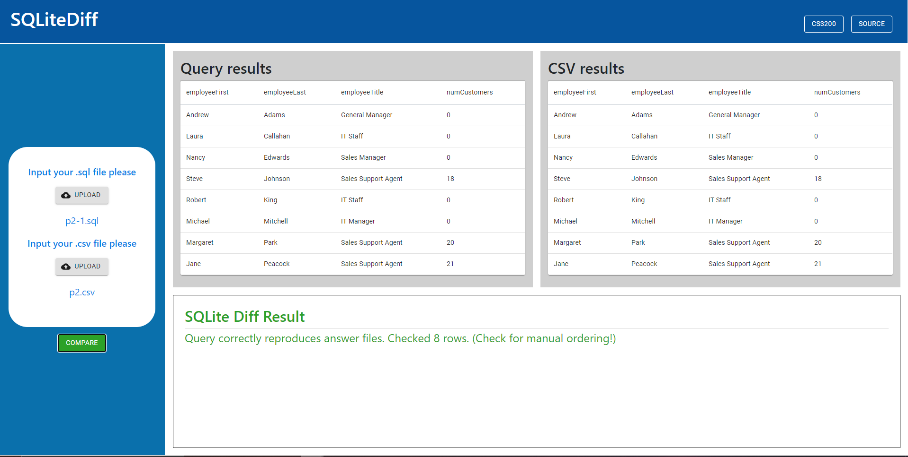
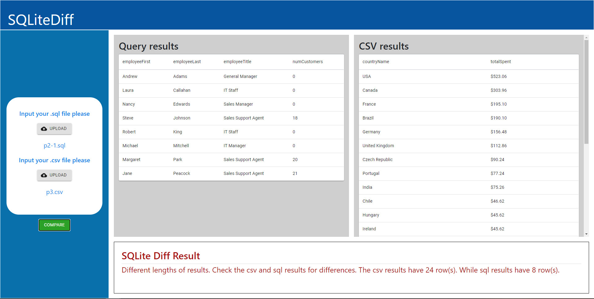

# SQLite Diff Web Application

This web application was made with Northeastern University Database Design course (CS3200) in mind. SQLite Diff was a program written by Professor Derbinsky to let students check their SQL homeworks, by comparing their query results with an answer csv file. This web application was created to be an more streamlined UI than the terminal of which the original program ran in. This project was a wonderful learning experience and a nice introduction to new techonologies. This project was made with ReactJS front-end with MaterialUI styling and a NodeJS back-end.

An example of usage. The following picture is when the query and csv results match.

Another example, the following picture shows when the query and csv results differ.

## How to use
This project contains both a server and the static files that are served, downloading both allows it to be used locally. Running the server should produce the files that will interact with the server which then interacts with the SQLite database. 

    1.) Install NodeJS to run the javascript based back-end
    2.) Download the project from the GitHub
    3.) Navigate to the newly downloaded project folder in the terminal
    4.) Use the command "node server.js" 
    5.) This command creates the server process and opens the default browser to the server (localhost:8080)
    6.) Upload your .sql and .csv files then hit compare

# Future plans
-Testing -Media queries for different screen widths -Implement Redux